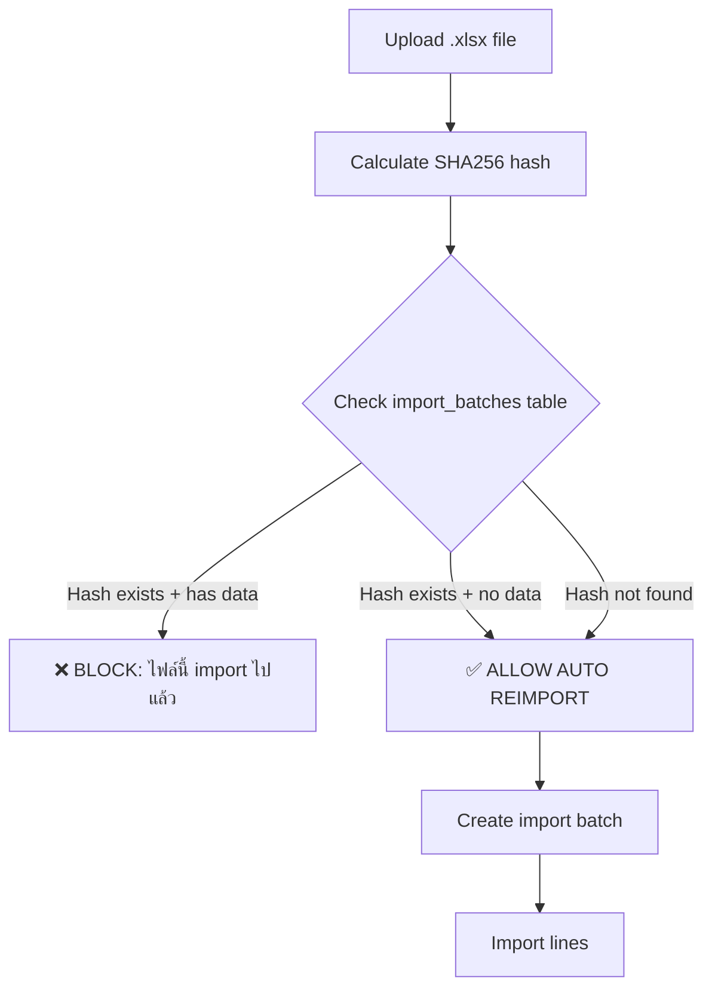
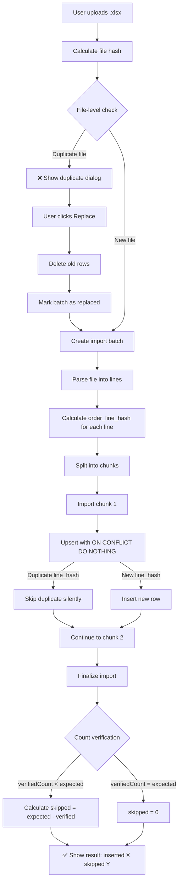

# Import Deduplication Guard

กลไกป้องกันการ import ข้อมูล Sales Orders ซ้ำซ้อน

---

## ปัญหาที่แก้ (Problem Statement)

**ก่อนมี Dedup Guard:**
- Import ไฟล์เดิมซ้ำ → ข้อมูลซ้ำในฐานข้อมูล → Revenue double-count
- Import ไฟล์บางส่วนที่ overlap → มี line items ซ้ำ → Metrics เพี้ยน
- ไม่มีวิธีตรวจสอบว่าไฟล์นี้ import ไปแล้วหรือยัง

**หลังมี Dedup Guard:**
- ✅ Import ไฟล์เดิมซ้ำ → Block ทันที พร้อมแจ้ง "ไฟล์นี้ import ไปแล้ว"
- ✅ Import ไฟล์ที่ overlap → Skip duplicate lines อัตโนมัติ (ระดับ line-level)
- ✅ แสดง skipped_duplicates_count ในผลลัพธ์

---

## กลไก Deduplication (2 Levels)

### Level 1: File-Level Deduplication

**วิธีการ:** ใช้ SHA256 file hash เพื่อตรวจจับไฟล์ซ้ำ

**Flow:**


**Implementation:**
```typescript
// Client-side: Calculate file hash
const fileHash = await calculateFileHash(fileBuffer)

// Server-side: Check existing import
const { data: existingBatch } = await supabase
  .from('import_batches')
  .select('id, file_name, created_at, inserted_count')
  .eq('file_hash', fileHash)
  .eq('marketplace', 'tiktok_shop')
  .eq('status', 'success')
  .single()

if (existingBatch && existingBatch.inserted_count > 0) {
  // Verify actual rows in DB (source of truth)
  const { count: actualRowCount } = await supabase
    .from('sales_orders')
    .select('*', { count: 'exact', head: true })
    .eq('import_batch_id', existingBatch.id)

  if (actualRowCount > 0) {
    return { success: false, status: 'duplicate_file', ... }
  }
}
```

**ตาราง:** `import_batches`
- `file_hash` (TEXT) - SHA256 hash ของไฟล์
- `marketplace` (TEXT) - tiktok_shop | shopee | ...
- `status` (TEXT) - processing | success | failed
- `inserted_count` (INT) - จำนวน rows ที่ insert สำเร็จ

**Edge Cases:**
1. **Orphaned batch** (batch exists แต่ sales_orders ไม่มีข้อมูล)
   - **เหตุผล:** Import failed หลังสร้าง batch แต่ก่อน insert rows
   - **การจัดการ:** ALLOW AUTO REIMPORT (skip duplicate check)

2. **Replace mode** (ผู้ใช้ต้องการ import ทับข้อมูลเดิม)
   - **UI:** แสดงปุ่ม "Replace and Re-import"
   - **Flow:** ลบ rows เก่า → Mark batch as 'replaced' → Import ใหม่

---

### Level 2: Line-Level Deduplication

**วิธีการ:** ใช้ `order_line_hash` (SHA256) เพื่อตรวจจับ line items ซ้ำ

**Hash Formula:**
```
order_line_hash = SHA256(
  created_by | source_platform | external_order_id |
  product_name | quantity | total_amount
)
```

**ตัวอย่าง:**
```
Input:
  created_by: "550e8400-e29b-41d4-a716-446655440000"
  source_platform: "tiktok_shop"
  external_order_id: "123456789"
  product_name: "เสื้อยืด สีแดง"
  quantity: 2
  total_amount: 200.00

Hash String:
  "550e8400-e29b-41d4-a716-446655440000|tiktok_shop|123456789|เสื้อยืด สีแดง|2|200.00"

SHA256:
  "a7b3c9d2e4f1..."
```

**Database Schema:**
```sql
-- Add column
ALTER TABLE sales_orders
ADD COLUMN order_line_hash TEXT;

-- Create unique index (full, not partial)
CREATE UNIQUE INDEX sales_orders_unique_created_by_order_line_hash
ON sales_orders(created_by, order_line_hash);
```

**Upsert Logic:**
```typescript
const { data, error } = await supabase
  .from('sales_orders')
  .upsert(salesRows, {
    onConflict: 'created_by,order_line_hash',
    ignoreDuplicates: false, // Update if exists (but we use DO NOTHING in practice)
  })
  .select()
```

**PostgreSQL Behavior:**
```sql
-- When inserting duplicate order_line_hash:
INSERT INTO sales_orders (...)
VALUES (...)
ON CONFLICT (created_by, order_line_hash)
DO NOTHING; -- ❌ Skip duplicate (no error thrown)

-- Result:
-- - Duplicate row is NOT inserted
-- - No error thrown (idempotent)
-- - Other non-duplicate rows are inserted normally
```

**จำนวน Skipped:**
```typescript
// Calculate skipped count
const insertedCount = verifiedCount // Actual rows in DB
const skippedCount = parsedData.length - verifiedCount // Lines that were duplicates
```

---

## Flow Chart (Full Import Process)



---

## UI/UX

### Import Result Toast
```
✅ Import Success
นำเข้า 950 รายการ (ข้าม 50 duplicates)
```

### Import Result Dialog
```
Import Success! ✅

Batch ID: a1b2c3d4...
นำเข้า: 950 รายการ
ข้าม: 50 รายการ (duplicates)
ช่วงวันที่: 2024-01-01 ถึง 2024-01-31
```

### Duplicate File Dialog
```
⚠️ ไฟล์ซ้ำ

ไฟล์นี้ถูก import ไปแล้วเมื่อ 2024-01-15 14:30 (1,000 รายการ)

[ยกเลิก] [Replace and Re-import]
```

---

## SQL Queries (Verification)

### 1. เช็คว่า File-Level Dedup ทำงานหรือไม่
```sql
-- หา import batches ที่ file_hash ซ้ำ
SELECT
  file_hash,
  COUNT(*) as batch_count,
  array_agg(id ORDER BY created_at) as batch_ids,
  array_agg(status ORDER BY created_at) as statuses,
  array_agg(inserted_count ORDER BY created_at) as row_counts
FROM import_batches
WHERE file_hash IS NOT NULL
  AND marketplace = 'tiktok_shop'
GROUP BY file_hash
HAVING COUNT(*) > 1
ORDER BY COUNT(*) DESC;

-- Expected:
-- - ถ้ามี batch_count > 1 → มี replace/reimport (ตรวจสอบว่า status = replaced)
-- - ถ้า statuses = [success, success] และ row_counts ไม่เป็น [N, 0] → ❌ File dedup ไม่เวิร์ค
```

### 2. เช็คว่า Line-Level Dedup ทำงานหรือไม่
```sql
-- หา order_line_hash ที่ซ้ำ (ไม่ควรมี)
SELECT
  order_line_hash,
  COUNT(*) as dup_count,
  array_agg(id) as row_ids,
  array_agg(created_at ORDER BY created_at) as created_ats
FROM sales_orders
WHERE order_line_hash IS NOT NULL
GROUP BY order_line_hash
HAVING COUNT(*) > 1;

-- Expected: 0 rows
-- ถ้ามี rows → unique constraint ไม่เวิร์ค หรือ migration-025 ยังไม่รัน
```

### 3. นับ Skipped Duplicates จาก Batch
```sql
-- Import history with skipped counts
SELECT
  id,
  file_name,
  created_at,
  row_count as lines_attempted,
  inserted_count as lines_inserted,
  skipped_count as lines_skipped,
  status,
  ROUND(skipped_count::decimal / NULLIF(row_count, 0) * 100, 2) as skip_rate_pct
FROM import_batches
WHERE marketplace = 'tiktok_shop'
  AND status = 'success'
  AND skipped_count > 0
ORDER BY created_at DESC
LIMIT 20;
```

---

## Testing Scenarios

### Test 1: Import ไฟล์ใหม่ (ครั้งแรก)
```
Input:
  - File: OrderSKUList_Jan2024.xlsx (1,000 lines)
  - File hash: abc123...
  - First time importing this file

Expected:
  ✅ imported: 1,000 รายการ
  ✅ skipped: 0 รายการ
  ✅ import_batches: file_hash=abc123, inserted_count=1,000
```

### Test 2: Import ไฟล์เดิมซ้ำ
```
Input:
  - File: OrderSKUList_Jan2024.xlsx (same file as Test 1)
  - File hash: abc123... (same)

Expected:
  ❌ BLOCKED with message: "ไฟล์นี้ถูก import ไปแล้ว"
  ❌ Dialog offers "Replace and Re-import" button
```

### Test 3: Import ไฟล์ที่ Overlap 50%
```
Input:
  - File: OrderSKUList_Jan15-31.xlsx (500 lines)
  - 250 lines = ซ้ำกับ Test 1
  - 250 lines = ใหม่

Expected:
  ✅ imported: 250 รายการ (ใหม่)
  ✅ skipped: 250 รายการ (ซ้ำ)
  ✅ Toast: "นำเข้า 250 รายการ (ข้าม 250 duplicates)"
```

### Test 4: Replace Mode
```
Input:
  - File: OrderSKUList_Jan2024.xlsx (same as Test 1)
  - User clicks "Replace and Re-import"

Expected:
  ✅ Step 1: Delete 1,000 old rows
  ✅ Step 2: Mark old batch as 'replaced'
  ✅ Step 3: Import 1,000 new rows
  ✅ Result: imported: 1,000, skipped: 0
```

---

## Troubleshooting

### ปัญหา 1: File Dedup ไม่ทำงาน (import ไฟล์ซ้ำได้)

**Symptoms:**
- Import ไฟล์เดิมซ้ำ → ข้อมูลซ้ำในฐานข้อมูล
- Query ไม่เจอ duplicate batch

**Root Cause:**
- `file_hash` ไม่ถูกเก็บในตาราง
- Query condition ไม่ match (marketplace, status, etc.)

**Fix:**
```sql
-- Check if file_hash is stored
SELECT COUNT(*), COUNT(file_hash)
FROM import_batches
WHERE marketplace = 'tiktok_shop';
-- ถ้า COUNT(file_hash) = 0 → ไม่ได้เก็บ hash

-- Fix: Ensure file_hash is passed to createImportBatch
```

### ปัญหา 2: Line Dedup ไม่ทำงาน (ข้อมูล line ซ้ำ)

**Symptoms:**
- Import ไฟล์ซ้ำ → skipped = 0 แต่ข้อมูลซ้ำจริง
- Query เจอ order_line_hash ซ้ำ

**Root Cause:**
- Unique index ไม่มี (migration-025 ยังไม่รัน)
- `order_line_hash` column ไม่มี (migration-024 ยังไม่รัน)
- Hash ถูกคำนวณผิด

**Fix:**
```sql
-- Check if unique index exists
SELECT indexname, indexdef
FROM pg_indexes
WHERE tablename = 'sales_orders'
  AND indexdef LIKE '%order_line_hash%';
-- Expected: sales_orders_unique_created_by_order_line_hash (WITHOUT WHERE clause)

-- If missing, run migration-025
```

### ปัญหา 3: Skipped Count ไม่แม่นยำ

**Symptoms:**
- Import แล้วแสดง skipped = 0 แต่รู้ว่ามีข้อมูลซ้ำ
- skipped count ติดลบ

**Root Cause:**
- `verifiedCount` ไม่ตรงกับความเป็นจริง
- Query count ผิด

**Fix:**
```typescript
// Ensure verification query is correct
const { count: actualCount } = await supabase
  .from('sales_orders')
  .select('*', { count: 'exact', head: true })
  .eq('import_batch_id', batchId)

const skippedCount = Math.max(0, parsedData.length - (actualCount || 0))
```

---

## สรุป

Import Deduplication Guard ใช้ 2 levels:
1. **File-level:** SHA256 file hash → Block ไฟล์ซ้ำ
2. **Line-level:** order_line_hash → Skip duplicate lines

ผลลัพธ์:
- ✅ ป้องกัน double-count revenue
- ✅ Import idempotent (import ซ้ำไม่เพิ่มข้อมูล)
- ✅ Transparency (แสดง skipped count)

Testing:
- ✅ Test import ไฟล์เดิมซ้ำ → BLOCKED
- ✅ Test import ไฟล์ที่ overlap → Skipped automatically
- ✅ Test Replace mode → Delete + Reimport
